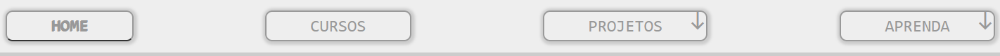
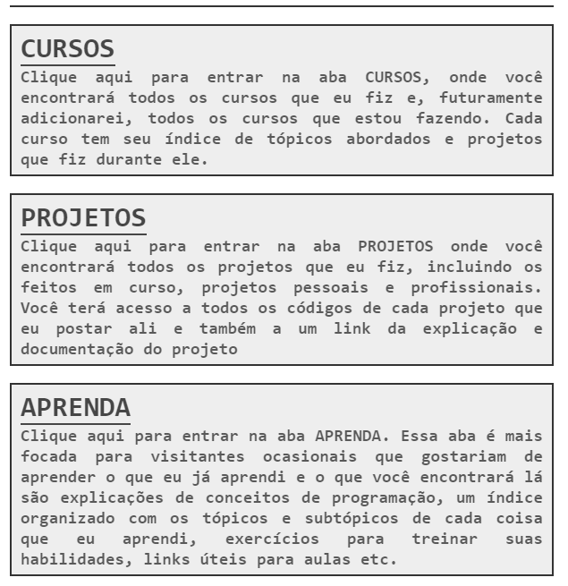
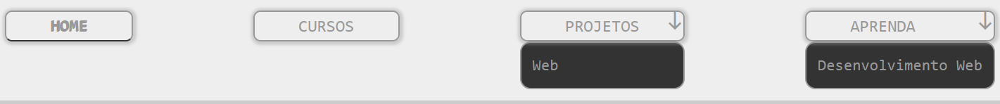

# My Learning In Programming

Esse é um portfólio onde eu planejo guardar meus projetos mais profissionais à medida que eu os vou construindo.  
Ao mesmo tempo que isto é um portfólio é também um lugar para eu ensinar outras pessoas tópicos de programação que eu estou aprendendo, para "testar meu conhecimento" nele ensinando para um público anônimo.  

- [Veja o site!](https://uns0g.github.io/my-learning-in-programming/)

## Navegação :globe_with_meridians:

A navegação no site é feita partir das abas do menu, que está logo abaixo do cabeçalho da página.



A aba principal também contém, além de uma descrição minha, uma seção à direita com cards que servem para navegação nas páginas principais do site. Os cards direcionam o visitante para o "index" de cada parte do site. 



Duas abas da página não direcionam para o index e sim para "tópicos" daquela parte em específico, essas duas abas são as duas últimas abas da esquerda para a direita e são as mais importantes partes do site, a parte do portfolio em si (Projetos) e a parte mais educativa (Aprenda).



Se o visitante quiser ver somente os projetos web (sites e webapps) basta ele clicar no item Web em projetos web e será direcionado à página com todos os projetos web, se quiser aprender sobre a web basta ele clicar no item Desenvolvimento Web e será direcionado ao artigo daquele tópico. 

## Como abrir o projeto :computer:

1. Clone o projeto na sua máquina com o comando ```git clone https://github.com/Uns0g/my-learning-in-programming```
2. Acesse o repositório na sua máquina
3. Clique sobre o arquivo index.html

---

Eu pretendo continuar e melhorar esse projeto com o passar do tempo.